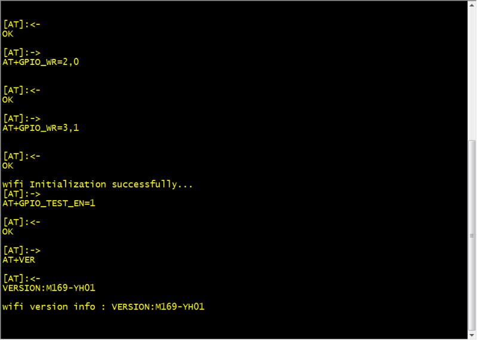

# AT Command

[](https://gitee.com/moluo-tech/ril/blob/master/LICENSE)

## 介绍
一种AT命令通信解析模块,支持裸机(at_chat)和OS版本(at)。适用于modem、WIFI模块、蓝牙通信。

## 软件架构

- at_chat.c at_chat.h list.h

用于无OS版本，使用链式队列及异步回调方式处理AT命令收发，支持URC处理、自定义命令发送与解析作业。
- at.c at.h at_util.h  comdef.h

用于OS版本, 使用前需要根据at_util.h规定的操作系统相关的接口进行移植,如提供信号量操作、任务延时等操作。


## 使用说明

### at_chat 模块(无OS)


#### 基本概念

at_chat 模块使用链式队列进行管理，包含2条链表，空闲链表和就绪链表。它们的每一个基本工作单元称为一个作业项，对于将要执行的命令都会放到就绪链表中，命令执行完成之后由空闲链表来进行回收，作业项的定义如下：

```c

/*AT作业项*/
typedef struct {
    unsigned int  state : 3;
    unsigned int  type  : 3;                                 /* 作业类型*/
    unsigned int  abort : 1; 
    void          *param;                                    /* 通用参数*/
	void          *info;                                     /* 通用信息指针*/
    struct list_head node;                                   /* 链表结点*/
}at_item_t;

```

作业是AT控制器定义时固定分配的，没有使用动态内存，默认支持10个作业项，即同时可以允许10个AT命令排队等待处理。

/*...未完，待续*/

#### 基本接口与描述
- at_send_singlline, 发送单行命令，默认等待OK响应，超时3S
- at_send_multiline, 多行命令，默认等待OK响应，超时3S
- at_do_cmd，支持自定义发送格式与接收匹配串
- at_do_work，支持自定义发送与接收解析

#### 效果演示

详细使用可以参考Demo程序wifi_task.c模块



#### 使用步骤

1.定义AT控制器及通信适配器接口
```c
/* 
 * @brief   定义AT控制器
 */
static at_obj_t at;

const at_adapter_t adap = {  //AT适配器接口
	//适配GPRS模块的串口读写接口
	.write       = uart_write,
	.read        = uart_read
	...
};

```

2.  初始化AT控制器并放入任务中轮询（考虑到处理实时性，建议20ms以下）

```c
/* 
 * @brief    wifi初始化
 */
void wifi_init(void)
{
	at_obj_init(&at, &adap);
	/*...*/
}driver_init("wifi", wifi_init); 

/* 
 * @brief    wifi任务(10ms 轮询1次)
 */
void wifi_task(void)
{
    at_poll_task(&at);
}task_register("wifi", wifi_task, 10);

```


#### 例子演示

```C
//WIFI IO配置命令
=> AT+GPIO_TEST_EN=1\r\n

<= OK\r\n
```
```c

/**
 * @brief AT执行回调处理程序
 */
static void test_gpio_callback(at_response_t *r)
{
	if (r->ret == AT_RET_OK ) {
	    printf("Execute successfully\r\n");
	} else {
	    printf("Execute failure\r\n");
	}
}
at_send_singlline(&at, test_gpio_callback, "AT+GPIO_TEST_EN=1");
```


### at 模块(OS版本)

由于AT命令通信是一个比较复杂的过程，对于没有OS的环境下处理难度比较大，也很绕,对于不允许阻塞程序，除了使用状态与+回调没有其它更好的办法，所以推荐使用这个模块

#### 基本接口与描述

- at_do_cmd，执行AT命令，可以通过这个接口进一步封装出一常用的单行命令、多行命令。
- at_split_respond_lines，命令响应分割器。
- at_do_work，适用于发送组合命令，如GPRS模组发送短信或者发送socket数据需要等待"<"或者"CONNECT"提示符，可以通过这个接口自定义收发。

#### 案例演示

参考我的另外一个项目[RIL(Radio Interface Layer)](https://gitee.com/moluo-tech/ril)

#### 使用步骤

1.定义AT控制器、通信适配器接口(包含URC回调函数表，接口缓冲区URC)
```c

static at_obj_t at;          //定义AT控制器对象

static char urc_buf[128];    //URC主动上报缓冲区

utc_item_t utc_tbl[] = {     //定义URC表
	"+CSQ: ", csq_updated_handler
}

const at_adapter_t adap = {  //AT适配器接口
	.urc_buf     = urc_buf,
	.urc_bufsize = sizeof(urc_buf),
	.utc_tbl     = utc_tbl,
	.urc_tbl_count = sizeof(utc_tbl) / sizeof(utc_item_t),	
	//debug调试接口
	.debug       = at_debug, 
	//适配GPRS模块的串口读写接口
	.write       = uart_write,
	.read        = uart_read
};

```

2.创建AT控制器并创建轮询处理线程

```c

void at_thread(void)
{
	at_obj_create(&at, &adap);
    while (1) {        
        at_process(&at);
    }
}

```
####  例子演示

#####  例子1(查询无线模组信号质量)
```c
/** at_do_cmd 接口使用演示
    查询GPRS模组信号质量命令
	=> AT+CSQ
	
	<= +CSQ: 24, 0
	<= OK
*/

/* 
 * @brief    获取csq值
 */ 
bool read_csq_value(at_obj_t *at, int *rssi, int *error_rate)
{
	//接收缓冲区
	unsigned char recvbuf[32];
	//AT应答
	at_respond_t r = {"OK", recvbuf, sizeof(recvbuf), 3000};
	//
	if (at_do_cmd(at, &r, "AT+CSQ") != AT_RET_OK)
		return false;
	//提取出响应数据
	return (sscanf(recv, "%*[^+]+CSQ: %d,%d", rssi, error_rate) == 2);

}

```

#####  例子2(发送TCP数据)
```C

/** at_do_work 接口使用演示
    参考自hl8518模组Socket 数据发送命令
	=> AT+KTCPSND=<session_id>,<ndata>
	
	<= CONNECT
	
	=> <data>
	
	<= OK
*/

/*
 * @brief       数据发送处理
 * @retval      none
 */
static bool socket_send_handler(at_work_ctx_t *e)
{
    struct socket_info *i = (struct socket_info *)e->params;
    struct ril_sock *s    = i->s;
    
    if (s->type == SOCK_TYPE_TCP)
        e->printf(e, "AT+KTCPSND=%d,%d", s->session, i->bufsize);
    else
        e->printf(e, "AT+KUDPSND=%d,%s,%d,%d",s->session, s->host, 
        s->port, i->bufsize);        

    if (e->wait_resp(e, "CONNECT", 5000) != AT_RET_OK) {      //等待提示符
       goto Error;
    }         
    e->write(i->buf, i->bufsize);                             //发送数据
    
    e->write("--EOF--Pattern--", strlen("--EOF--Pattern--")); //发送结束符

    if (e->wait_resp(e, "OK", 5000) == AT_RET_OK)
        return true;
    else {   
Error:
        e->write("--EOF--Pattern--", strlen("--EOF--Pattern--"));
        return false;
    }
}

/**
 * @brief       socket 数据发送
 * @param[in]   s   - socket
 * @param[in]   buf - 数据缓冲区
 * @param[in]   len - 缓冲区长度
 */
static bool hl8518_sock_send(ril_obj_t *r, struct ril_sock *s, const void *buf, 
                       unsigned int len)
{
    struct socket_info info = {s, (unsigned char *)buf, len, 0};
    if (len == 0)
        return false;       
    return at_do_work(&r->at, (at_work)socket_send_handler, &info);
}


```
