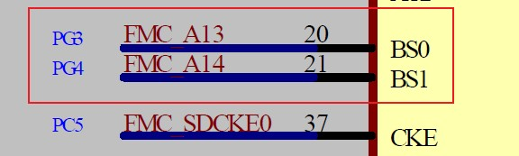
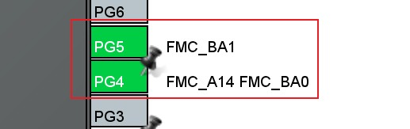

# Greenhouse Controller: 基于物联网的新型大规模气肥施放系统

  
- [Greenhouse Controller: 基于物联网的新型大规模气肥施放系统](#greenhouse-controller-基于物联网的新型大规模气肥施放系统)
  - [更新说明](#更新说明)
  - [简介](#简介)
  - [功能](#功能)
  - [使用方式](#使用方式)
  - [关键点](#关键点)
  - [测试项目](#测试项目)
  - [测试说明](#测试说明)
  - [函数说明](#函数说明)
  - [存在问题](#存在问题)

## 更新说明

| Date       | Author | Note          | Version number |
| ---------- | ------ | ------------- | -------------- |
| 2022.06.13 | LHC    | First edition | V1.0.0         |

## 简介

- 大棚控制器主要由 主板卡MCU: **STM32H743xx**、子板卡副MCU: **STM32F030F4x** 和 **迪文屏幕DMG10600C101_15WTR** 构成。
- 硬件板卡基本配置情况：
  -主MCU板卡：集成了``4G`` 、``WIFI``、``USB``等基础外设，包括外扩的SDRAM``W9825G6DH``  和 QSPI FLASH``W25Q256FVEIG``等
  外挂芯片和标桩的 ``RS232`` 和 ``RS485``通讯接口。
  - AI：基本模拟量输入板卡，标准``8`` 路电压/电流型信号输入。
  - AO: 基本模拟量输出板卡，标准``8`` 电流（4-20mA）型信号输出。
  - DI：基本数字量输入板卡，标准``8`` 数字信号输入接口，支持12V-24V直流电源输入。
  - DO: 基本数字量输出板卡，标准``8`` 数字信号输出接口，回路支持交直流任意电压。
  - CO: 基本局域网通信，接入模块支持LORA、光纤等局域网组网芯片。
  - 特别说明：
    > 数字输出和模拟输出，目前仅支持远程模块4G进行控制，数字输出（部分引脚占用）受用户逻辑影响（在自动模式时）。

## 功能

- 大棚控制器，在原[气站控制器](https://github.com/LHC324/Station-controller)基础上,通过模拟PLC的外部数据采集策略(数字信号高、低电平和模拟信号4-20mA、电压信号0-10V)，映射到内存指定地址，内部从机号(4G/wifi远程访问站号)``0x02``。
- 四种信号：数字输入、数字输出、模拟输入、模拟输出均在内存中设有独立地址，操作策略遵循``Modbus``协议约定。
- ``RS485`` 访问站号 ``0x03`` ,目前暂未和站号 ``0x02`` 关联，故内部变量地址并不关联。
- 目前上层用户逻辑，主要通过检测``4``路模拟信号输入，分别组合控制``14``个电磁阀动作。

## 使用方式

- 注意按照IO外部接线图纸，正确连接各部分线路。
- 除用户逻辑占用的部分IO外，剩余输出IO可自由通过远程设置其状态。
- 用户默认登录名为：``2022`` , 密码为 ``1314``。
- 其内部阈值设定界面参数，均与用户逻辑紧密相关，参数设定与选取需查看需求文档后``谨慎``操作。

## 关键点

- 硬件部分：
  - 对于主MCU板:
    - 外部晶振源大小为 ``25MHz``。
    - 底部卡槽板卡的``16``根中断线均需要并联上``0.01uF``电容减小静电干扰。
    - V3.0版本的硬件，SDRAM的块选线存在错位问题。
      - 错误的设计：
     
      - 正确的设计：
     
    - 使用``Jlingk``下载器下载时存在:断电后下载无法同步时钟频率，导致软件卡住现象。
    - 硬件看门狗实际并未启用[2022.06.13]
  - 子板卡副MCU板:
    - 下载调试接口被用作``74HC138``译码器输入信号，在二者在任何时候只能选择其一(为了便于下载程序，在``mian``函数中加入了HAL_Delay(5000))。
    

- 软件部分：

    - **内存地址**映射关系

   | 寄存器组         | 映射对象 | 地址范围      | 操作类型 | 规则     |
   | ---------------- | -------- | ------------- | -------- | -------- |
   | InputCoil        | 数字输入 | 10001 - 19999 | R        | 顺序对应 |
   | Coil             | 数字输出 | 00001 - 09999 | R/W      | 顺序对应 |
   | Input Register   | 模拟输入 | 30001 - 39999 | R        | 顺序对应 |
   | Holding Register | 模拟输出 | 40001 - 49999 | R/W      | 顺序对应 |

   -  **站号** 对应外设
 
    | 站号id | 对应外设                 | 访问参数                | 访问方式 | 访问周期       |
    | ------ | ------------------------ | ----------------------- | -------- | -------------- |
    | 0x02   | 4G云平台                 | 115200 + 无校验位 + CRC | 云端轮询 | 1Min           |
    | 0x02   | WIFI云平台               | 115200 + 无校验位 + CRC | 云端轮询 | 1Min           |
    | 0x02   | 用户线程**Control_Task** | 线程参数                | 内核调度 | 1S             |
    | 0x03   | 外部RS485请求对象        | 9600 + 无校验位 +CRC    | 被动回复 | 发起请求方决定 |

    - 说明：
      - 目前应用场景比较简单，内部从站 ``0x03`` 与四种信号实际并无关联。
      - 目前底板仅仅支持接入**8**张字板卡，实际设计考虑的最多支持到**16**张。
      - 目前通信线路的速度为:**115200**bps。
      - 支持子板卡随意改变位置。（仅仅在组态时）
    - 模拟量与物理量换算关系说明：[CSDN博客](https://blog.csdn.net/weixin_36443823/article/details/112775994)
  
    - **OTA Flash**分区

     | 类型        | 起始地址    | 大小  | 中断向量偏移量 |
     | ----------- | ----------- | ----- | -------------- |
     | bootloader  | 0x0800 0000 | 128KB | 0              |
     | app1        | 0x0802 0000 | 256KB | 0x20000        |
     | app2        | 0x0806 0000 | 256KB | 0x60000        |
     | update_flag | 0x081C 0000 | 128KB | NULL           |
     | user_flag   | 0x081E 0000 | 128KB | NULL           |

     - 注意：
       > H743的flash按扇区进行划分，每个扇区``128KB``，分为2个BANK，每个BNAK编号范围: 0 - 7, 因为带有10bit的ECC，所以总线位宽为256bit，每次通过2条64bitAXI数据总线进行访问，每次擦除也是按照最少一个扇区进行擦除。
    
    - 工作流程
      - 板卡接入底板时，板卡自身处理流程：
        - 不同类型板卡上电后先读取一次板卡型号（板卡类型编码和卡槽编码组成），通过该值来来确定本板卡站号。站号编码规则：[卡槽编码从0开始]
	        - 主CPU板站号为0x00,其他从机板卡号根据卡槽位置依次顺延，比如卡槽1上板卡站号为0x01。
	        - 从机板卡的寄存器Map编码规则：
		       - 所有从机板卡寄存器均根据板卡类型进行裁剪，比如数字输入板卡，仅保留输入线圈寄存器组的访问权限。
	         - 如果主CPU错误的访问当前板卡的越界寄存器组，为避免出错，从板卡不做处理且不应答。
       - 所有板卡插入卡插槽时，均在IRQ线上产生中断信号，等待主CPU读取板卡编号后清除中断信号。

       - 中断信号产生条件：
	       - 数字输入板卡：当板卡检测到有新的信号接入或者拔出，发出一个中断信号通知主CPU处理。
	       - 数字输出板卡，只有在上电时发中断信号，通知主CPU读取板卡ID后清除中断，其他时候输出信号变化后由主CPU主动建立通讯连接。
	       - 模拟输入板卡：当模拟板卡的某一路信号跳变过大(0.5mA)时，主动发出中断信号，要求主CPU立即处理；其他时候由主CPU轮询调度来上报信息。
	       - 模拟输出信号：与数字输出板卡采用的策略一致。

     - 主CPU处理卡槽上不同类型板卡的流程：
       - 主CPU上电时（主CPU中断线全部上拉），根据中断系统（依据卡槽的中断线优先级）读取中断编码到中断表，由中断裁决系统二次确定最终优先级并交给调度系统定夺。
	      = 主CPU中断系统优先级编码规则(数小优先)：
		      - 板卡中断优先级确定规则：模拟输入 > 数字输入 > 数字输出 > 模拟输出信号
		      - 当出现卡槽中插入多张同类型板卡时处理规则：相同类型板卡中断优先级由卡槽顺序决定。比如卡槽1模拟板卡优先级高于卡槽2模拟板卡。
	      - 最终优先级确定规则：
		      - 不同类型板卡优先级范围：[中断编码上限范围：0x50]
			      - 模拟输入板卡：0x00-0x0F.
			      - 数字输入板卡：0x10-0x1F.
			      - 数字输出板卡：0x20-0x2F.
			      - 模拟输出板卡：0x30-0x3F.
			      - 通信板卡：    0x40-0x4F.
	
		    - 根据返回的板卡信息表，先查询表中是否存在模拟输入类型板卡，如果存在，则编码规则为：
			    - 卡槽1模拟板卡优先级为：0x00, 对应的卡槽为：0x00-0x0F, 如果板卡数量不止一张，则第二张优先级为：0x01,对应的卡槽为：0x00-0x0F,依次编码到最后一张该类型板卡。
		    - 其他板卡中断优先级确定规则同上。
	
     - 主CPU对所有读取到板卡类型（板卡类型编码和卡槽编码）进行合理化裁定，比如如果读到不存在板卡类型或者不存在卡槽号时，需判定本板卡无效，且在屏幕上显示板卡错误图标。
       
     - 不同类型板卡在主CPU寄存器Map中映射规则：
	     - 数字输入板卡：以检测到第一张板卡开始（不理会在卡槽中位置），映射到输入寄存器组范围：0x00-0x07，
		     如果系统中存在不止一张板卡，则接下寄存器地址为：N*8U + Qi(其中N为板卡序号，Qi为板卡对应的输出信号，8为每张数字板卡的固定物理通道数)。
	     - 其他三种类型板卡地址映射规则均同上。
	     - 不同类型板卡寄存器映射有效范围:
		     - 数字输入板卡：0x00 - 0x7F.
		     - 数字输出板卡：0x00 - 0x7F.
		     - 模拟输入板卡：0x00 - 0xFF.(一个模拟量占用两个16bit寄存器)
		     - 模拟输出板卡：0x00 - 0xFF;
	
    - 主CPU工作在有线模式下的调度策略：
	     - 主CPU通过中断查询任务，定时轮询一张中断表，检测该表中是否存在中断请求任务，如果存在，则通过优先级编码表找到最高优先级卡槽进行响应。
	     - 无论中断表中是否有中断请求任务，如果系统中存在模拟输入板卡，则主CPU都要对该板卡进行轮询（1S）数据查询来更新本地寄存器Map。
		
     - 主CPU工作在无线模式下的调度策略：
	     - 此时将屏蔽四种类型：DI、DO、AI、AO板的中断请求(无论中断产生与否)，不做处理，此时主要响应通信板中断请求。
	     - 主CPU对通信板中断处理流程：(中断编码优先级与模拟输入板优先级编码一致)主CPU对通信CPU发出数据后，等待通信板CPU收到外部设备的数据请 求后，发出的中断信号，确定本次远程控制有效性。
	
## 测试项目

- **数字量输入** 和 **数字量输出** 与硬件引脚对应关系。
- **模拟量输入** 对应ADC与电流间关系。
- **模拟量输出** 对应DAC与电流间关系。
- **屏幕各组件** 间地址映射、数据变量下发、上传与阈值界定测试。
- **用户逻辑** 测试各输入物理量与对应电磁阀间动作关系。
- **远程OTA** 测试下载和上载不同大小的程序块。

## 测试说明

- 模拟量与数字量所有测试均通过。
- 屏幕组件测试通过（控制部分：**数字量输出**和**模拟量输出**并未测试）。
- 用户逻辑，启动模式、停机模式、安全模式基本保障点以按照文档测试通过。

## 函数说明

- 暂略。

## 存在问题

- **WIIF模块** 云端参数上传和远程升级暂未实现。
- **Shell** 端口内部配置行为未启用。
- **DO输出阀门** 的持续时间和间隔时间暂未加入。
- **迪文屏幕** 对数字量输出和模拟量输出暂未支持。
- **迪文屏幕** 阈值设定界面中参数输入小数点仅支持一位（迪文屏幕原因:用``定点小数``表示浮点数）。
- **ADC与DAC** 参数自动校准程序暂未匹配。
- **模拟量输出** 仅云平台具有相应权限后可以修改。
- **OTA升级** 不同版本程序，中断向量偏移量必须与``App1``和``App2``启动地址一一对应。
- **Save_Param结构** 当向内部怎加成员时，要在**Report_Backparam**中减去非阈值界面参数成员所占用的地址，否则可能覆盖迪文屏幕其他图标变量。
- **模拟输出板卡** 策略暂未考虑清楚，故暂不作输出适配。
- **USB** 目前为USB虚拟串口功能。
- **QSPI_FLASH 和 SDRAM** 暂时没有启用。
- **通信板卡** 暂未接入使用。